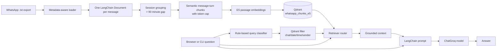
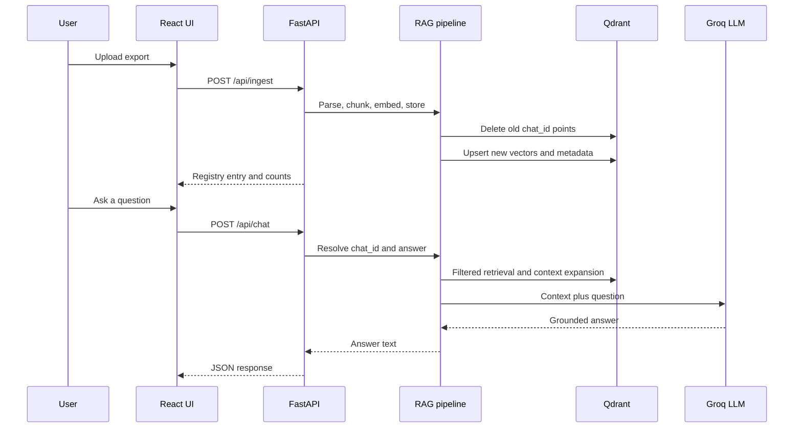
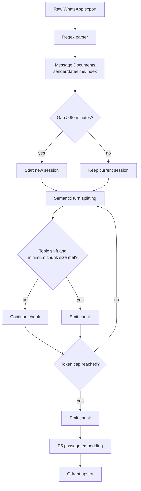
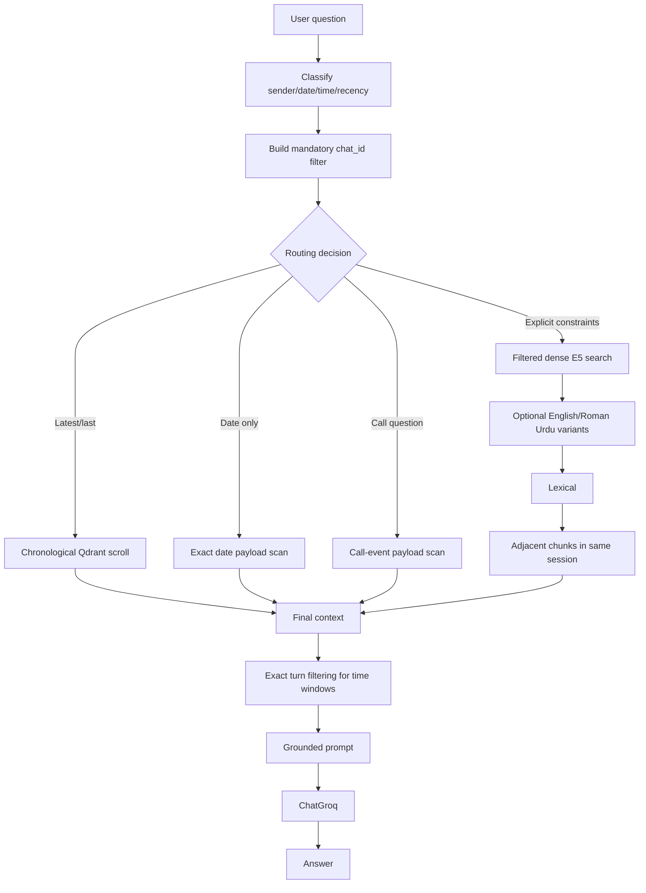

# WhatsRAG AI

WhatsRAG AI is a private, chat-scoped retrieval-augmented generation (RAG)
application for searching WhatsApp `.txt` exports. It combines a FastAPI
backend, a React/Vite frontend, LangChain components, multilingual embeddings,
and Qdrant vector storage.

The system is deliberately a conventional RAG pipeline rather than an
agentic workflow or a CRAG implementation. It parses the export, preserves
message-level metadata, creates conversation-aware chunks, retrieves grounded
evidence, and asks a Groq-hosted chat model to answer from that evidence.

## What It Does

- Accepts WhatsApp exports from Android and iOS.
- Preserves sender, date, time, message order, and conversation boundaries.
- Supports multiple imported chats with an explicit `chat_id` isolation boundary.
- Answers semantic questions such as summaries and topic searches.
- Handles sender, date, time-window, call-event, and recency questions.
- Supports English and Roman Urdu search phrasing.
- Uses local embedded Qdrant storage by default, with optional Qdrant server support.
- Provides both a browser UI and an interactive terminal CLI.

## Architecture



### Web request flow



## Technology Choices

| Area | Technology | Why it is used |
| --- | --- | --- |
| Backend API | FastAPI + Uvicorn | Small async HTTP boundary with multipart upload, JSON validation, and easy local development. |
| Frontend | React 18 + Vite | Lightweight browser UI with a fast development server and production build. |
| Orchestration | LangChain 0.3 | Provides the `Document`, embeddings, prompt, runnable, model, and vector-store interfaces used by the pipeline. |
| Answer model | `ChatGroq` | Hosted generation with configurable model name and token limits. |
| Embeddings | `intfloat/multilingual-e5-base` | Better fit for English, Roman Urdu, and multilingual chat search than an English-only embedding model. |
| Vector store | `QdrantVectorStore` | Stores embeddings and structured payload metadata together, enabling semantic search plus Qdrant filters. |
| Default persistence | Embedded Qdrant at `backend/local_qdrant` | No separate database process is required for local use. |
| Token counting | `tiktoken` with `cl100k_base` | Enforces chunk and prompt-context budgets consistently. |
| Date parsing | `python-dateutil` | Interprets natural-language and numeric dates in user questions. |
| UI icons | `lucide-react` | Consistent icons without maintaining custom SVG assets. |

## Repository Layout

```text
.
|-- backend/
|   |-- api.py                         FastAPI endpoints and chat registry
|   |-- config.py                      Environment-backed runtime settings
|   |-- main.py                        CLI ingestion and interactive chat
|   |-- chats_registry.json            Generated chat metadata registry
|   |-- chains/rag_chain.py            LCEL prompt -> model -> answer chain
|   |-- loaders/whatsapp_loader.py     Android/iOS export parser
|   |-- pipeline/ingest.py             End-to-end indexing workflow
|   |-- pipeline/query_pipeline.py     Per-chat RAG pipeline and exact scans
|   |-- retrievers/query_classifier.py Sender/date/time query extraction
|   |-- retrievers/router.py           Retrieval routing and context expansion
|   |-- splitters/semantic_splitter.py Two-stage conversation chunking
|   |-- vectorstore/qdrant_store.py   Embeddings and Qdrant connection
|   |-- local_qdrant/                  Generated embedded Qdrant data
|-- frontend/
|   |-- package.json                   npm scripts and dependencies
|   |-- vite.config.js                 Vite configuration, port 5173
|   `-- src/App.jsx                    Upload, chat list, and chat drawer UI
|-- requirements.txt                   Pinned Python dependencies
|-- .env.example                       Configuration template
`-- README.md
```

`backend/chats_registry.json` and `backend/local_qdrant/` are runtime data.
They are ignored by Git and are created or updated during ingestion.

## Prerequisites

- Windows, macOS, or Linux.
- Python 3.10+ recommended.
- Node.js and npm for the frontend.
- A Groq API key for answer generation and query expansion.
- Enough disk space for the Hugging Face model download on first run.

The first call to the embedding layer downloads
`intfloat/multilingual-e5-base` through `sentence-transformers`.

## Installation on Windows

Run these commands from the repository root in PowerShell:

```powershell
py -3 -m venv .venv
.\.venv\Scripts\Activate.ps1
python -m pip install --upgrade pip
python -m pip install -r requirements.txt

Copy-Item .env.example .env

Push-Location frontend
npm install
Pop-Location
```

If PowerShell blocks activation, either activate from `cmd.exe` with
`.venv\Scripts\activate.bat` or run the project commands with the explicit
interpreter path `.venv\Scripts\python.exe`.

### Installation on macOS/Linux

```bash
python3 -m venv .venv
source .venv/bin/activate
python -m pip install --upgrade pip
python -m pip install -r requirements.txt
cp .env.example .env
cd frontend && npm install && cd ..
```

## Configuration

Copy `.env.example` to `.env` at the repository root. `backend/config.py`
loads the root file first and also accepts `backend/.env`.

| Variable | Default | Purpose |
| --- | --- | --- |
| `GROQ_API_KEY` | none | Required for answer generation and semantic query expansion. |
| `GROQ_MODEL_NAME` | `openai/gpt-oss-120b` | Groq model passed to `ChatGroq`. |
| `LLM_MAX_TOKENS` | `1500` | Maximum generated answer tokens. |
| `MAX_CONTEXT_TOKENS` | `3800` | Maximum retrieved context sent to the model. |
| `QDRANT_URL` | `http://localhost:6333` | Qdrant server URL. If local port 6333 is unavailable, embedded storage is used. |
| `QDRANT_API_KEY` | empty | Optional key for a remote Qdrant instance. |
| `WHATSAPP_DAY_FIRST` | `false` | Set `true` for `day/month/year` exports; default compatibility behavior prefers `month/day/year`. |
| `WHATSAPP_TIMEZONE` | `Asia/Karachi` | IANA timezone used for timestamps and interval filters. |
| `VITE_API_URL` | `http://localhost:8000` | Backend URL used by the Vite frontend. |

Do not commit `.env`. The `.gitignore` excludes secrets, exports, generated
Qdrant data, and the chat registry.

## Running the Application

### Full web application

Start the backend in one PowerShell window:

```powershell
\.venv\Scripts\Activate.ps1
Set-Location backend
python -m uvicorn api:app --host 127.0.0.1 --port 8000 --reload
```

Start the frontend in a second window:

```powershell
Set-Location frontend
npm run dev
```

Open [http://localhost:5173](http://localhost:5173). The frontend calls the
backend at `http://localhost:8000` unless `VITE_API_URL` is configured.

### CLI mode

From the repository root:

```powershell
\.venv\Scripts\Activate.ps1
python backend/main.py ingest C:\path\to\WhatsApp_Chat_Export.txt
python backend/main.py chat
```

The CLI lists registered chats, lets you select one, and opens an interactive
question loop. Press `Ctrl+C` or send EOF to exit.

## Using the Web UI

1. Open the frontend.
2. Select a WhatsApp `.txt` export in **Ingest export**.
3. Wait for parsing, chunking, embedding, and storage to finish.
4. Select **Chat AI** on the imported chat.
5. Ask a question in the chat drawer.
6. Use **Re-ingest** after replacing or changing the source export.

The application derives a chat display name from the first non-`You` sender
unless an explicit name is supplied through Python code. The generated slug is
used as the `chat_id`, so importing the same chat again replaces its existing
vectors rather than duplicating them.

## API Reference

### `GET /api/health`

Returns service status and the number of registered chats.

```json
{
  "status": "ok",
  "chat_count": 2
}
```

### `GET /api/chats`

Returns the registry object used to render the chat list.

### `GET /api/contacts`

Returns a backwards-compatible flat list of all senders across registered
chats.

### `POST /api/ingest`

Accepts `multipart/form-data` with a `file` field. Only non-empty `.txt`
exports are accepted. A successful response includes the registered chat,
message count, chunk count, sender list, and all known chats.

Example with PowerShell:

```powershell
curl.exe -X POST http://localhost:8000/api/ingest `
  -F "file=@C:\path\to\chat.txt"
```

### `POST /api/chat`

Request:

```json
{
  "chat_id": "ahmad_abdullah",
  "message": "What did Ahmad say about the meeting last month?"
}
```

Response:

```json
{
  "answer": "..."
}
```

`message` must contain 1-4000 characters. If `chat_id` is not registered,
the API returns HTTP 409. Invalid uploads return HTTP 400 or 415; unexpected
ingestion and chat failures return HTTP 500.

## Ingestion Pipeline



### 1. Format-aware parsing

`backend/loaders/whatsapp_loader.py` recognizes common Android and iOS lines:

```text
9/7/26, 8:50 PM - Ahmad Abdullah: Ni ki
[9/7/26, 8:50:15 PM] Ahmad Abdullah: Ni ki
```

Each parsed message becomes a LangChain `Document`. Continuation lines are
appended to the previous message. The parser normalizes dates to `YYYY-MM-DD`
and times to `HH:MM`.

### 2. Session grouping

Consecutive messages remain in one session until the gap between two messages
exceeds `HARD_TIME_GAP_MINUTES` (90 by default). This avoids cutting an active
conversation merely because it spans several hours.

### 3. Semantic sub-chunking

Within each session, the splitter keeps complete message turns together. It
uses a running average of the most recent four message embeddings to detect a
topic shift, subject to these safeguards:

- A semantic boundary is used only after at least three messages or 80 tokens.
- A hard 500-token chunk ceiling is always enforced by default.
- Message turns are never split in the middle of their text.
- Each chunk stores sender, source-message range, timestamps, session ID,
  chunk index, message count, and token count.

### 4. Embedding and persistence

The E5 adapter applies the model's required asymmetric prefixes:

- Documents: `passage: ...`
- Questions: `query: ...`

Embeddings are normalized and stored in the `whatsapp_chunks_e5` collection.
The collection name is intentionally versioned so embedding spaces are not
mixed accidentally.

## Query and Retrieval Behavior



The classifier is intentionally rule-based and lightweight. It extracts
explicit constraints without trying to answer the question. Every route adds
`metadata.chat_id` to its Qdrant filter, preventing one imported chat from
being used to answer a question about another.

Retrieval details:

- **Recency:** scrolls the scoped payloads and sorts by `end_ts`.
- **Date-only questions:** scan matching payloads so short URL-only turns are
  not lost because of a low dense-search score.
- **Time windows:** use interval overlap at the chunk level, then retain only
  individual timestamped turns inside the requested window.
- **Semantic/hybrid questions:** combine filtered E5 similarity with a small
  lexical backfill for names, amounts, URLs, and Roman Urdu terms.
- **Meaning checks:** scan the filtered chat for exact, prefix, and fuzzy term
  matches when a dense top-k result could hide a relevant message.
- **Conversation context:** add adjacent chunks from the same session.

## RAG Answer Chain

`backend/chains/rag_chain.py` builds this LCEL composition:

```text
question
  -> RunnableParallel({ context: router | format_docs,
                        question: RunnablePassthrough() })
  -> ChatPromptTemplate
  -> ChatGroq
  -> StrOutputParser
  -> answer string
```

The system prompt requires strict grounding: the model must answer from the
retrieved context and explicitly say when the context is insufficient. It also
contains behavior for exact message listings, verification questions, latest
messages, chronology, English, and Roman Urdu.

## Re-ingestion and Data Lifecycle

Ingestion deletes existing Qdrant points for the resolved `chat_id` before
adding the newly generated chunks. This makes re-ingestion the normal way to
apply parser, splitter, metadata, or embedding changes.

When the chunk schema or embedding model changes, re-ingest every affected
chat. Do not mix old vectors with the current `whatsapp_chunks_e5` schema.
The API invalidates the in-memory pipeline cache after a successful ingest so
the next question reconnects with current data.

To remove local data completely, stop the backend and delete these generated
paths manually:

```powershell
Remove-Item backend\local_qdrant -Recurse -Force
Remove-Item backend\chats_registry.json -Force
```

Only use that command when you intend to remove every locally indexed chat.

## Testing and Validation

There is currently no automated test suite in the repository. The following
checks are useful after setup:

```powershell
# Backend import/syntax smoke check
python -m compileall backend

# API health check while Uvicorn is running
curl.exe http://localhost:8000/api/health

# Frontend production build
Set-Location frontend
npm run build
```

For a meaningful end-to-end check, ingest a small export, confirm that the
returned `message_count` and `chunk_count` are non-zero, then ask one semantic
question and one constrained question with a sender/date/time window.

## Troubleshooting

### `GROQ_API_KEY` errors

Confirm that `.env` is in the repository root, contains a valid key, and that
the backend was restarted after changing it. The key is needed for answer
generation. Without it, the router can still use the original query for
retrieval, but the application cannot reliably generate answers.

### The embedding model downloads repeatedly or fails

Check internet access, disk space, and the active Python environment. The
model is downloaded by Hugging Face on first use; the local cache is outside
this repository.

### Qdrant connection behavior is unexpected

With the default `QDRANT_URL`, the store tries `localhost:6333`. If that port
is unavailable, it falls back to embedded storage under
`backend/local_qdrant`. A non-local `QDRANT_URL` is treated as a remote Qdrant
server and uses `QDRANT_API_KEY` when supplied.

### Dates are interpreted incorrectly

WhatsApp exports do not include locale metadata. Set `WHATSAPP_DAY_FIRST=true`
for day/month exports and configure `WHATSAPP_TIMEZONE` to the timezone of the
export. Re-ingest after changing either setting.

### Chat returns no results after code changes

Re-ingest the source export. Current retrieval depends on metadata such as
`chat_id`, `session_id`, `chunk_index`, `start_ts`, and `end_ts`.

### Frontend cannot reach the backend

Ensure Uvicorn is running on port 8000, the frontend is running on port 5173,
and `VITE_API_URL` matches the backend origin. The FastAPI CORS allowlist
currently includes `http://localhost:5173` and `http://127.0.0.1:5173`.

## Known Limitations

- The parser targets standard Android and iOS text export formats; unusual
  localized formats may need additional regex patterns.
- Media-only messages and some system notifications do not provide ordinary
  sender text and may not be useful for semantic retrieval.
- Structured retrieval still uses Qdrant payload filtering and, for some
  branches, similarity ranking. Exhaustive raw ordering is implemented through
  scoped Qdrant scrolls where the pipeline requires it.
- The registry is a local JSON file, not a multi-user database.
- There is no authentication layer; do not expose the API directly to the
  public internet.
- The frontend currently keeps chat messages in browser memory and does not
  persist conversation history between page reloads.

## Privacy and Security Notes

WhatsApp exports can contain sensitive personal information. Keep `.env`, raw
exports, `backend/local_qdrant/`, and `backend/chats_registry.json` private.
The application is designed for local use, but questions and retrieved context
are sent to the configured Groq model for answer generation. Review your
provider's data handling terms before indexing sensitive material.

## License

No license file is currently included in this repository. Add a project license
before distributing the application outside its intended private environment.
